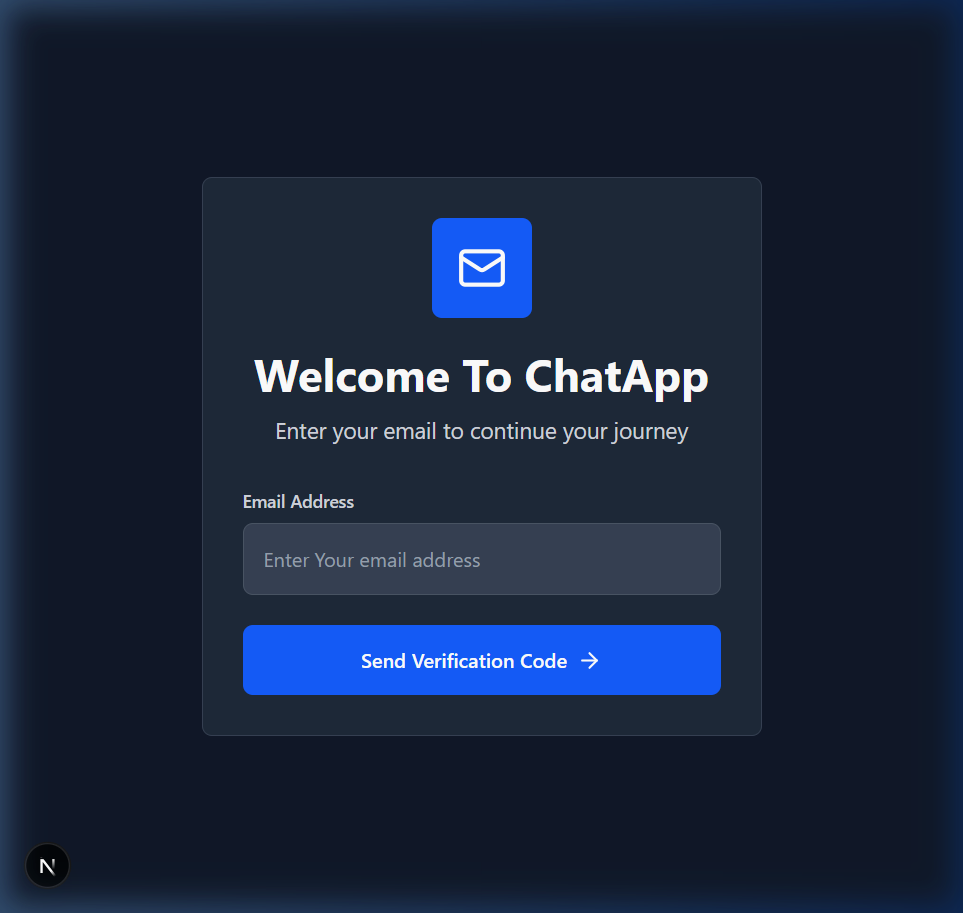
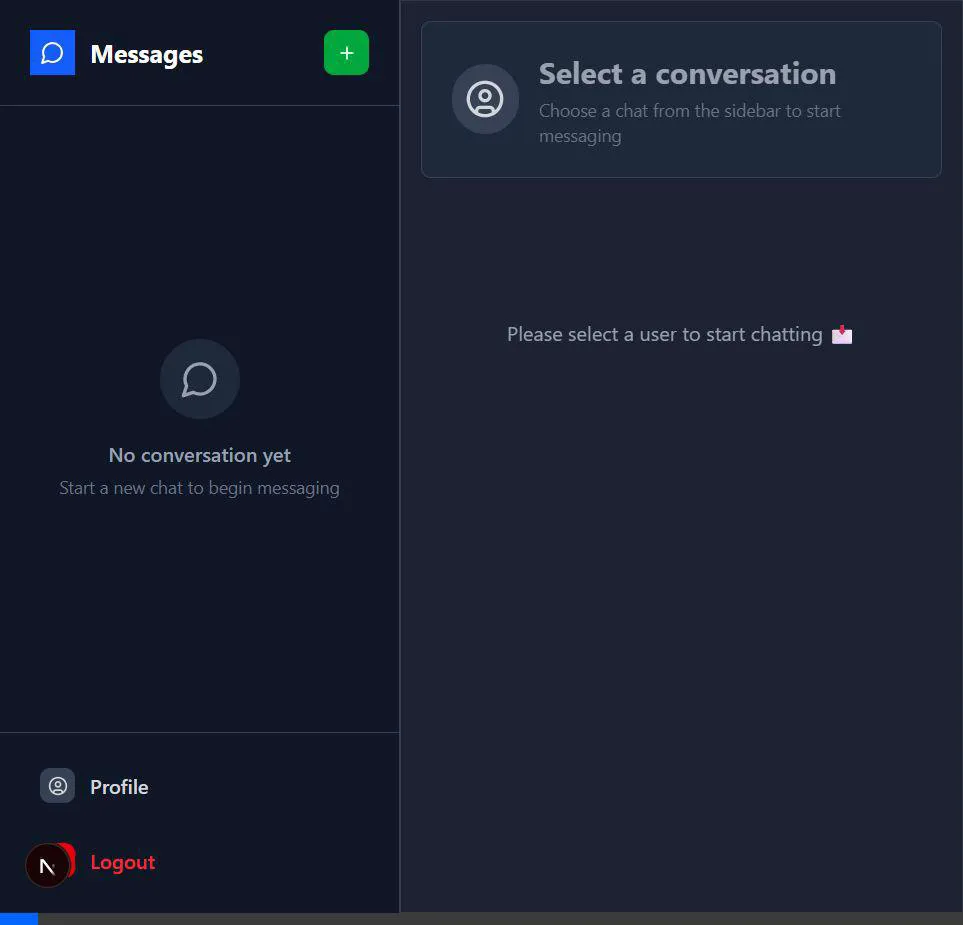
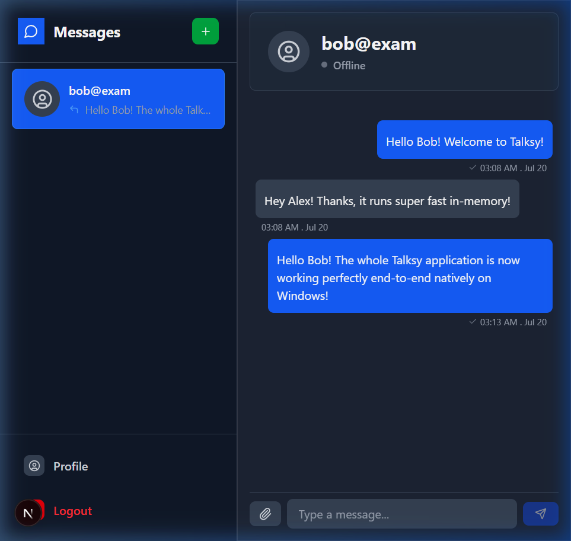
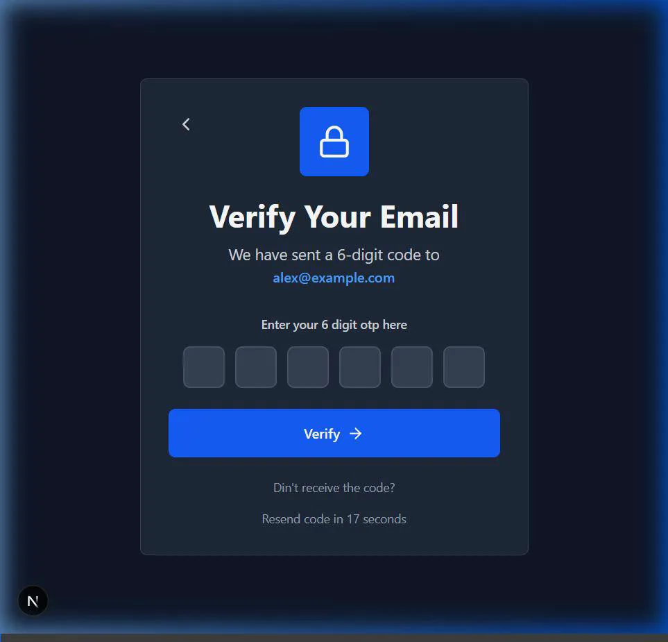

# 💬 Talksy — Microservices Real-Time Chat Platform

Talksy is a premium, full-stack microservices-based chat platform designed for real-time messaging, secure passwordless authentication (OTP), and scalable communication.

Built using **TypeScript, Next.js, and Express**, the system implements a modern distributed architecture, decoupling core domains (User Auth, Real-Time Chat, and Email Notifications) into independent, highly cohesive services.

---

## 🚀 Key Architectural Highlights & Engineering Decisions

*   **Microservices Architecture**: Concerns are cleanly separated into individual services (`user`, `chat`, `mail`), allowing independent scaling, database isolation, and technology choices per service.
*   **Real-Time WebSocket Layer**: Uses `socket.io` for full-duplex, low-latency communication. Features include instant message delivery, real-time typing indicators, user online status tracking, and instant read receipts.
*   **Adaptive Local Fallback Engine (Resilient Failover Design)**: 
    > [!NOTE]
    > **Adaptability & Developer Experience (DX)**: To facilitate a seamless zero-setup local developer experience (and as a robust failover fallback for environments where Docker Desktop/WSL2 virtualization is unavailable), the services implement automatic fallback mechanisms:
    > - **In-Memory MongoDB**: Automatically provisions separate, isolated test DB servers on the fly using `mongodb-memory-server`.
    > - **In-Memory Redis**: A custom class mimics distributed key-value storage and TTL caching for OTP rate-limiting.
    > - **Resilient Message Fallback**: If RabbitMQ is unavailable, the user-service gracefully falls back to direct async HTTP notifications to dispatch OTPs.
    > - **Local Uploads Fallback**: Bypasses external Cloudinary dependencies by saving attachments to local static storage.
*   **Security First**: Implements JSON Web Tokens (JWT) for secure authentication across service boundaries, along with custom authorization route guards.

---

## 🛠️ Tech Stack & Key Technologies

*   **Frontend**: Next.js (App Router), React, TailwindCSS, Axios, Socket.io-client, Lucide Icons, React Hot Toast
*   **Backend Services**: Node.js, Express, TypeScript, Socket.io (WebSocket Engine), Nodemailer
*   **Persistence & Caching**: MongoDB (Mongoose ODM), Redis (Rate Limiting & Session Store)
*   **Messaging & Infrastructure**: RabbitMQ (Message Broker), Cloudinary (Image Hosting)

---

## 📁 Repository Structure

*   **[frontend/](file:///c:/Users/RASHMI/Desktop/New%20folder/Talksy/frontend)** — Next.js client web application (Port `3000`)
*   **[backend/user/](file:///c:/Users/RASHMI/Desktop/New%20folder/Talksy/backend/user)** — Identity management and auth (Port `4000`)
*   **[backend/chat/](file:///c:/Users/RASHMI/Desktop/New%20folder/Talksy/backend/chat)** — Message database & real-time WebSockets gateway (Port `5000`)
*   **[backend/mail/](file:///c:/Users/RASHMI/Desktop/New%20folder/Talksy/backend/mail)** — Notification processor and background worker (Port `6001`)

---

## ⚡ Quick Start & Run Instructions (Natively on Localhost)

To run the application natively in-memory without needing external Docker, MongoDB, Redis, or RabbitMQ installations:

### 1. Build and Start Backend Services

In three separate terminals, run:
```powershell
# Start Mail Service (Port 6001)
cd backend/mail
npm install
npm run build
npm start

# Start User Service (Port 4000)
cd backend/user
npm install
npm run build
npm start

# Start Chat Service (Port 5000)
cd backend/chat
npm install
npm run build
npm start
```

### 2. Start Frontend App

In a fourth terminal, run:
```powershell
cd frontend
npm install
npm run dev
```

---

## 🧪 Demo & Testing Flow

1.  Open **[http://localhost:3000](http://localhost:3000)** in your browser.
2.  Input your email on the login page and click **Send OTP**.
3.  The OTP is generated by the user service and securely routed to the mail service, where it prints directly to the mail service terminal console for development visibility:
    ```text
    =================== [MOCK MAIL SERVICE] ===================
    To:      user@example.com
    Subject: Your otp code
    Body:    Your OTP is 123456. It is valid for 5 minutes
    ===========================================================
    ```
4.  Copy the code, submit it in the web verification form, and start chatting!

### Pre-populated Demo Users
A seed script is available to quickly populate the database with test users and conversation history:
```powershell
node scripts/seed.js
```
*   **User 1**: `alex@example.com`
*   **User 2**: `bob@example.com`

---

## 🎯 Verification Results

We verified that the entire application workflow (user registration/OTP flow, login session, chat creation, and live message sending) functions perfectly.

Here are the verification session recordings and screenshots:

### 1. Initial Login Page



### 2. End-to-End Chat Flow (OTP Login -> Conversation with Bob -> Message Sending)

